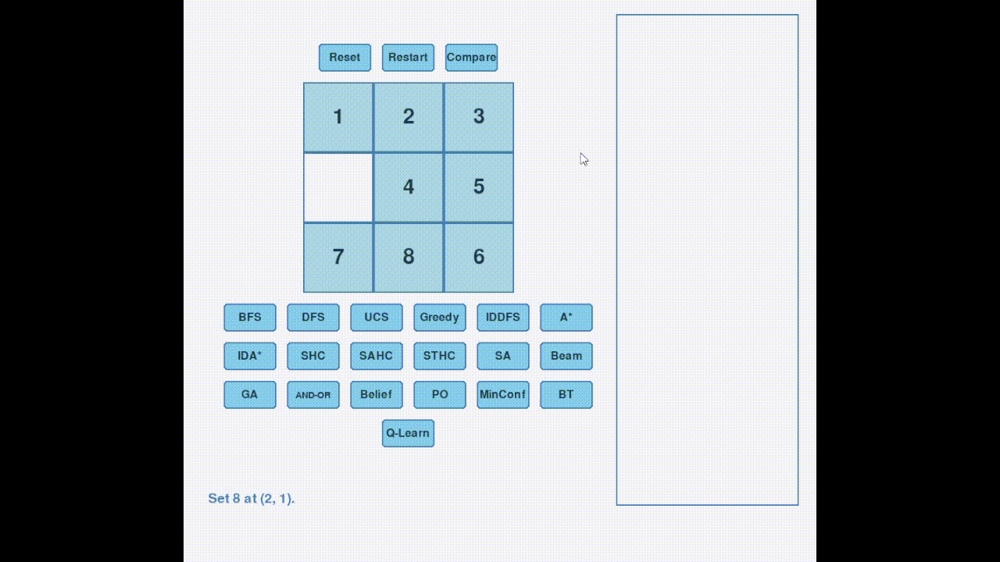
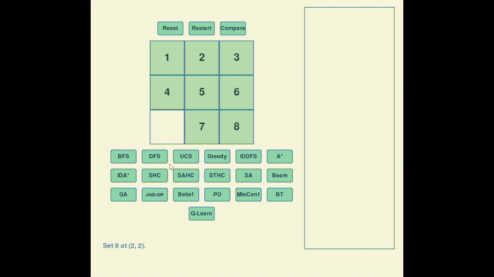
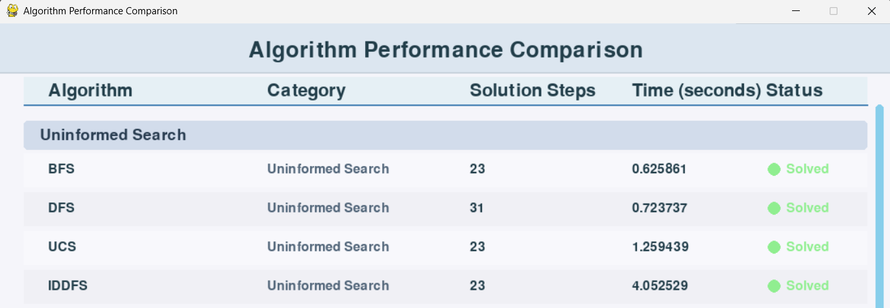
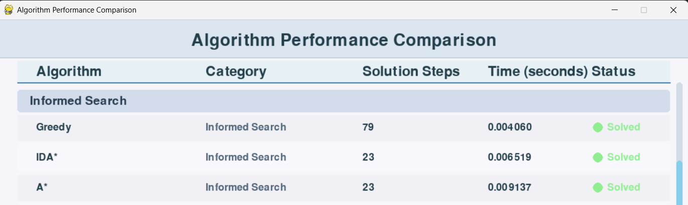
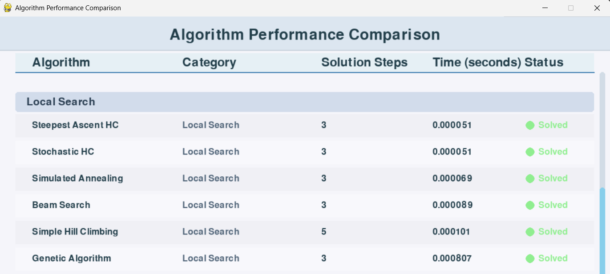
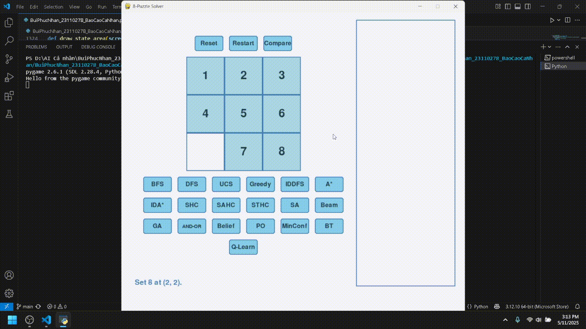
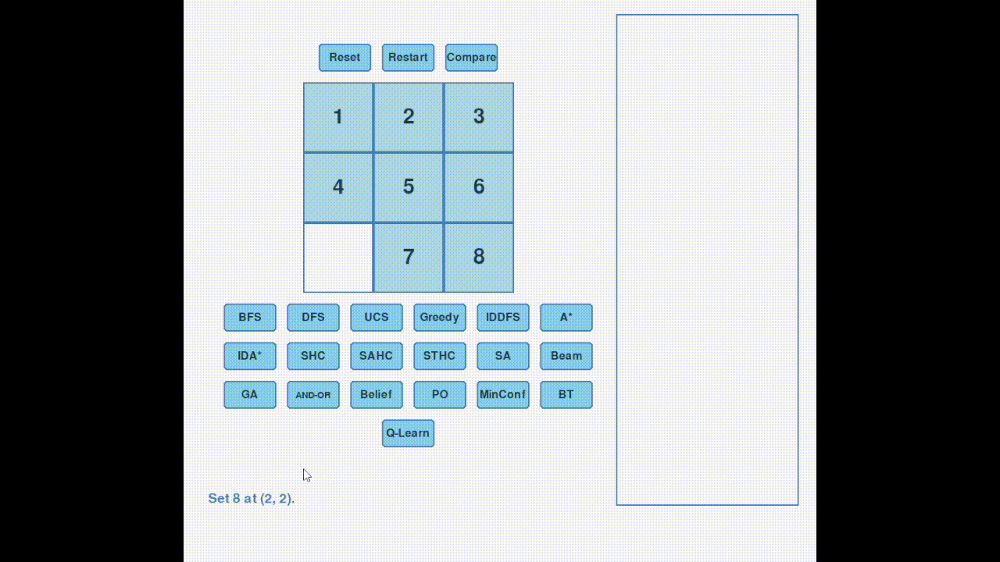
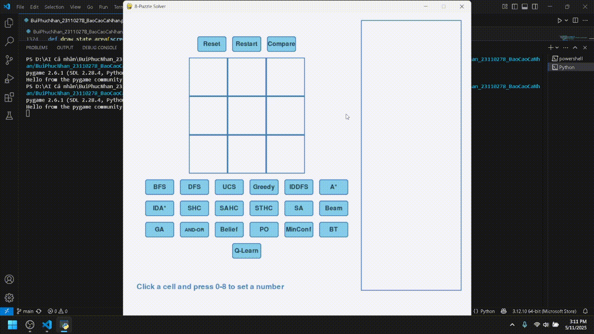
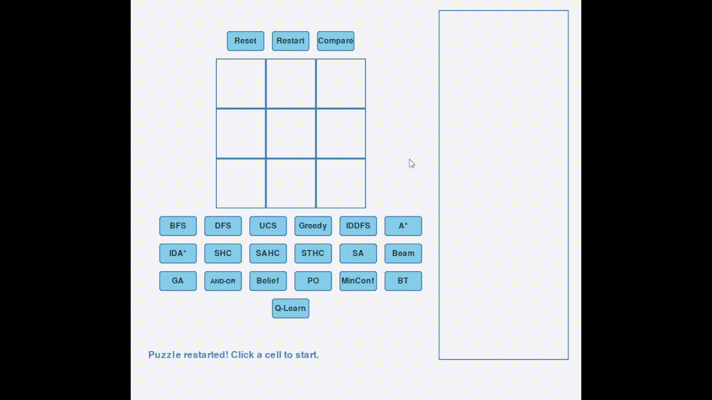

# 8-Puzzel Solver
Sinh viên thực hiện: Bùi Phúc Nhân 

MSSV: 23110278

Báo cáo đồ án cá nhân bộ môn Trí Tuệ Nhân Tạo

---
## Mục lục
- [1. Mục tiêu](#1-mục-tiêu)
- [2. Nội dung](#2-nội-dung)
  - [2.1 Các thuật toán tìm kiếm không có thông tin](#21-các-thuật-toán-tìm-kiếm-không-có-thông-tin)
  - [2.2 Các thuật toán tìm kiếm có thông tin](#22-các-thuật-toán-tìm-kiếm-có-thông-tin)
  - [2.3 Các thuật toán Local Search](#23-các-thuật-toán-local-search)
  - [2.4 Các thuật toán tìm kiếm ở môi trường phức tạp](#24-các-thuật-toán-tìm-kiếm-ở-môi-trường-phức-tạp)
  - [2.5 Các thuật toán Constraint Satisfaction Problems (CSPs)](#25-các-thuật-toán-constraint-satisfaction-problems-csps)
  - [2.6 Các thuật toán Reinforcement Learning](#26-các-thuật-toán-reinforcement-learning)
- [3. Kết luận](#3-kết-luận)
  - [3.1 Kết quả đạt được](#31-kết-quả-đạt-được)
  - [3.2 Hướng phát triển](#32-hướng-phát-triển)
---
# 1. Mục tiêu
Mục tiêu của đồ án này là tìm hiểu, cài đặt và so sánh hiệu quả các thuật toán trí tuệ nhân tạo trong việc giải quyết bài toán 8-Puzzle. Thông qua việc áp dụng nhiều nhóm thuật toán khác nhau như tìm kiếm không có thông tin, tìm kiếm có thông tin, local search, tìm kiếm trong môi trường phức tạp, constraint satisfaction problems và reinforcement learning, báo cáo giúp làm rõ ưu nhược điểm của từng phương pháp. Ngoài ra, việc xây dựng giao diện trực quan bằng pygame giúp quan sát quá trình giải bài toán, từ đó nâng cao hiểu biết về các thuật toán AI, rèn luyện kỹ năng lập trình và tư duy giải quyết vấn đề.

---
# 2. Nội dung
## 2.1 Các thuật toán tìm kiếm không có thông tin
Nhóm thuật toán tìm kiếm không có thông tin (uninformed search) là các phương pháp tìm kiếm không sử dụng bất kỳ thông tin nào về khoảng cách đến trạng thái đích, chỉ dựa vào cấu trúc không gian trạng thái. Các thuật toán này như BFS, DFS, IDDFS, UCS thường đảm bảo tìm được lời giải nếu tồn tại, nhưng có thể tốn nhiều thời gian và bộ nhớ khi không gian trạng thái lớn.
### 2.1.1 Thuật toán BFS
BFS được dùng để giải bài toán 8-puzzle bằng cách tìm kiếm theo chiều rộng trên không gian trạng thái. Thuật toán duyệt từng lớp các trạng thái, bắt đầu từ trạng thái ban đầu, mở rộng tất cả các trạng thái kề bằng cách di chuyển ô trống (0) lên/xuống/trái/phải. Mỗi trạng thái được lưu cùng đường đi đã thực hiện. BFS đảm bảo tìm được lời giải ngắn nhất (ít bước nhất) nếu tồn tại, nhờ sử dụng hàng đợi (queue) và tập hợp các trạng thái đã thăm để tránh lặp lại. Khi gặp trạng thái đích, thuật toán trả về đường đi từ trạng thái ban đầu đến trạng thái đích.

Gif minh họa:

### 2.1.2 Thuật toán DFS
Thuật toán DFS (Depth-First Search) là thuật toán tìm kiếm theo chiều sâu, ưu tiên đi sâu vào từng nhánh trước khi quay lại các nhánh khác. Trong 8-Puzzle, DFS sử dụng stack để lưu các trạng thái, mỗi lần sẽ di chuyển ô trống theo các hướng hợp lệ và tiếp tục mở rộng đến khi gặp trạng thái đích hoặc đạt giới hạn độ sâu. Để tránh lặp vô hạn, thuật toán có kiểm soát độ sâu và đánh dấu trạng thái đã thăm ở từng mức. DFS có ưu điểm là tiết kiệm bộ nhớ nhưng có thể không tìm được đường đi ngắn nhất và dễ bị lặp nếu không kiểm soát tốt.

Gif minh họa: 

### 2.1.3 Thuật toán Iterative deepening (IDDFS)
Thuật toán IDDFS (Iterative Deepening Depth-First Search) là sự kết hợp giữa DFS và BFS. Ý tưởng là thực hiện DFS nhiều lần với giới hạn độ sâu tăng dần, bắt đầu từ 0, 1, 2,... cho đến khi tìm thấy lời giải hoặc đạt giới hạn. Ở mỗi lần lặp, thuật toán sẽ tìm kiếm theo chiều sâu nhưng không vượt quá độ sâu hiện tại. Nhờ đó, IDDFS vừa tiết kiệm bộ nhớ như DFS, vừa đảm bảo tìm được lời giải ngắn nhất như BFS. Tuy nhiên, nhược điểm là phải lặp lại nhiều lần nên có thể tốn thời gian hơn.

Gif minh họa:

### 2.1.4 Thuật toán Uniform Cost Search (UCS)
Thuật toán Uniform Cost Search (UCS) là một biến thể của BFS nhưng có xét đến chi phí đường đi. UCS sử dụng hàng đợi ưu tiên (priority queue), luôn mở rộng trạng thái có tổng chi phí nhỏ nhất từ trạng thái ban đầu đến trạng thái hiện tại. Trong 8-Puzzle, mỗi bước di chuyển thường có chi phí bằng nhau nên UCS sẽ tìm được lời giải ngắn nhất giống như BFS. Tuy nhiên, UCS có thể áp dụng tốt cho các bài toán mà chi phí di chuyển giữa các trạng thái khác nhau. Nhược điểm là tốc độ chậm nếu không gian trạng thái lớn, do phải kiểm tra và cập nhật chi phí liên tục. 

Gif minh họa:

### So sánh hiệu suất của các thuật toán tìm kiếm không có thông tin

Trong cùng 1 trạng thái khởi đầu, kết quả cho thấy BFS, UCS và IDDFS đều tìm được lời giải ngắn nhất với 23 bước, trong khi DFS tìm được lời giải dài hơn (31 bước). Về thời gian, BFS giải nhanh nhất, tiếp theo là DFS, UCS chậm hơn do phải kiểm tra chi phí liên tục, còn IDDFS có thời gian lâu nhất vì phải lặp lại nhiều lần với các giới hạn độ sâu khác nhau. Nhìn chung, BFS là lựa chọn tốt nhất về cả số bước và tốc độ cho 8-Puzzle với chi phí di chuyển đồng nhất.
## 2.2 Các thuật toán tìm kiếm có thông tin
Nhóm thuật toán tìm kiếm có thông tin (informed search) sử dụng các hàm heuristic để ước lượng chi phí còn lại đến trạng thái đích, giúp quá trình tìm kiếm hiệu quả hơn. Các thuật toán như A*, IDA*, Greedy thường tìm được lời giải nhanh hơn và tối ưu hơn so với các thuật toán không có thông tin, đặc biệt khi heuristic tốt.
### 2.2.1 Thuật toán A*
Thuật toán A* là thuật toán tìm kiếm có thông tin, kết hợp giữa chi phí thực (g) từ trạng thái ban đầu đến trạng thái hiện tại và giá trị heuristic (h) ước lượng chi phí còn lại đến đích. Trong 8-Puzzle, heuristic thường dùng là tổng khoảng cách Manhattan của các ô về đúng vị trí. A* sử dụng hàng đợi ưu tiên, luôn mở rộng trạng thái có tổng chi phí f = g + h nhỏ nhất. Nhờ đó, A* thường tìm được lời giải ngắn nhất với tốc độ nhanh hơn BFS/UCS khi heuristic tốt. Tuy nhiên, nếu heuristic không chính xác, thuật toán có thể tốn nhiều bộ nhớ và thời gian.

Gif minh họa:

### 2.2.2 Thuật toán IDA*
Thuật toán IDA* (Iterative Deepening A*) là sự kết hợp giữa A* và tìm kiếm lặp sâu dần. IDA* sử dụng giá trị f = g + h (g là chi phí thực, h là heuristic) làm ngưỡng cắt, sau đó thực hiện tìm kiếm theo chiều sâu nhưng không vượt quá ngưỡng này. Nếu không tìm thấy lời giải, thuật toán sẽ tăng ngưỡng lên giá trị nhỏ nhất lớn hơn ngưỡng cũ và lặp lại quá trình. Nhờ đó, IDA* tiết kiệm bộ nhớ hơn A* nhưng vẫn đảm bảo tìm được lời giải ngắn nhất nếu heuristic tốt. Tuy nhiên, IDA* có thể phải lặp lại nhiều lần nên tốc độ có thể chậm hơn A* trong một số trường hợp.

Gif minh họa: 

### 2.2.3 Thuật toán Greedy
Thuật toán Greedy (tìm kiếm tham lam) sử dụng giá trị heuristic để quyết định mở rộng trạng thái nào tiếp theo, mà không quan tâm đến chi phí đã đi (g). Trong 8-Puzzle, heuristic thường dùng là tổng khoảng cách Manhattan của các ô về đúng vị trí. Greedy luôn chọn trạng thái có heuristic nhỏ nhất để mở rộng trước, với mục tiêu tiến nhanh nhất về đích. Ưu điểm là tốc độ nhanh, nhưng nhược điểm là dễ rơi vào bẫy cục bộ và không đảm bảo tìm được lời giải ngắn nhất.

Gif minh họa:

### So sánh hiệu suất của các thuật toán tìm kiếm có thông tin

Trong cùng 1 trạng thái khởi đầu, kết quả cho thấy A* và IDA* đều tìm được lời giải ngắn nhất với 23 bước, trong khi Greedy tìm được lời giải dài hơn (79 bước). Tuy nhiên, Greedy có tốc độ giải nhanh nhất do chỉ quan tâm đến heuristic mà không xét chi phí đã đi, còn A* và IDA* chậm hơn một chút nhưng đảm bảo tối ưu về số bước. Nhìn chung, A* là lựa chọn tốt nhất khi cần lời giải ngắn nhất và tốc độ vẫn rất nhanh, còn Greedy phù hợp khi ưu tiên tốc độ mà không cần lời giải tối ưu.
## 2.3 Các thuật toán Local Search
Nhóm thuật toán Local Search tập trung vào việc cải thiện dần lời giải hiện tại bằng cách chỉ xét các trạng thái lân cận (neighbor). Các thuật toán như Beam Search, Hill Climbing, Simulated Annealing, Genetic Algorithm phù hợp cho các bài toán có không gian trạng thái lớn, không cần lưu toàn bộ đường đi, nhưng có thể bị kẹt ở điểm cực trị cục bộ và không đảm bảo tìm được lời giải tối ưu.
### 2.3.1 Thuật toán Beam Search
Thuật toán Beam Search là một biến thể của tìm kiếm theo chiều rộng có giới hạn số lượng trạng thái được mở rộng ở mỗi mức (gọi là beam width). Ở mỗi bước, thuật toán chỉ giữ lại một số trạng thái tốt nhất dựa trên giá trị heuristic (ví dụ: tổng khoảng cách Manhattan), các trạng thái còn lại sẽ bị loại bỏ. Nhờ đó, Beam Search tiết kiệm bộ nhớ và thời gian hơn so với BFS truyền thống, nhưng có thể bỏ lỡ lời giải tối ưu nếu beam width quá nhỏ. Beam Search phù hợp khi cần cân bằng giữa tốc độ và chất lượng lời giải.

Gif minh họa:

### 2.3.2 Thuật toán Genetic Algorithm 
Thuật toán Genetic Algorithm (di truyền) mô phỏng quá trình tiến hóa tự nhiên để tìm lời giải cho 8-Puzzle. Mỗi cá thể trong quần thể là một trạng thái của trò chơi. Thuật toán bắt đầu với một quần thể các trạng thái ngẫu nhiên, sau đó lặp lại các bước: đánh giá độ thích nghi (fitness), chọn lọc các cá thể tốt nhất, lai ghép (crossover) và đột biến (mutation) để tạo ra thế hệ mới. Quá trình này tiếp tục cho đến khi tìm được trạng thái đích hoặc đạt số thế hệ tối đa. Genetic Algorithm có thể tìm ra lời giải trong không gian trạng thái lớn, nhưng không đảm bảo tối ưu và kết quả phụ thuộc vào tham số cũng như ngẫu nhiên.

Gif minh họa:

### 2.3.3 Thuật toán Simple Hill Climbing 
Thuật toán Simple Hill Climbing là một phương pháp tìm kiếm địa phương, luôn chọn trạng thái kề có giá trị heuristic tốt hơn hiện tại (thường là tổng khoảng cách Manhattan nhỏ hơn). Quá trình lặp lại cho đến khi không còn trạng thái nào tốt hơn, khi đó thuật toán có thể mắc kẹt tại điểm cực trị cục bộ (local optimum). Ưu điểm là thuật toán đơn giản, tốc độ nhanh, nhưng nhược điểm là dễ bị kẹt và không đảm bảo tìm được lời giải tối ưu.

Gif minh họa:

### 2.3.4 Thuật toán Steepest Ascent Hill Climbing
Thuật toán Steepest Ascent Hill Climbing là một biến thể của Hill Climbing, ở mỗi bước sẽ xét tất cả các trạng thái kề và chọn trạng thái có giá trị heuristic tốt nhất (giảm nhiều nhất so với hiện tại) để di chuyển. Quá trình lặp lại cho đến khi không còn trạng thái nào tốt hơn, khi đó thuật toán có thể mắc kẹt tại điểm cực trị cục bộ. Ưu điểm là đơn giản, dễ cài đặt, nhưng vẫn có nguy cơ bị kẹt và không đảm bảo tìm được lời giải tối ưu.

Gif minh họa:

### 2.3.5 Thuật toán Stohastic Hill Climbing
Thuật toán Stochastic Hill Climbing là một biến thể của Hill Climbing, thay vì luôn chọn trạng thái kề tốt nhất, thuật toán sẽ chọn ngẫu nhiên một trạng thái kề có giá trị heuristic tốt hơn hoặc bằng hiện tại để di chuyển. Quá trình này giúp tránh bị kẹt ở một số điểm cực trị cục bộ, nhưng vẫn có thể mắc kẹt nếu không còn neighbor tốt hơn. Ưu điểm là đơn giản, có khả năng thoát khỏi một số bẫy cục bộ, nhưng không đảm bảo tìm được lời giải tối ưu.

Gif minh họa: 

### 2.3.6 Thuật toán Simulated Annealing
Thuật toán Simulated Annealing mô phỏng quá trình tôi luyện kim loại, cho phép nhận các trạng thái kém hơn với xác suất giảm dần theo nhiệt độ. Ở mỗi bước, thuật toán chọn ngẫu nhiên một trạng thái kề, nếu tốt hơn thì nhận luôn, nếu kém hơn thì vẫn có thể nhận dựa trên xác suất. Nhiệt độ sẽ giảm dần sau mỗi bước, giúp thuật toán có khả năng thoát khỏi điểm cực trị cục bộ. Ưu điểm là có thể tìm được lời giải tốt trong không gian lớn, nhưng kết quả phụ thuộc vào tham số và không đảm bảo tối ưu tuyệt đối.

Gif minh họa:

### So sánh hiệu suất của các thuật toán tìm kiếm Local Search

Trong cùng 1 trạng thái khởi đầu, kết quả cho thấy hầu hết các thuật toán Local Search như Steepest Ascent Hill Climbing, Stochastic Hill Climbing, Simulated Annealing, Beam Search và Genetic Algorithm đều tìm được lời giải ngắn nhất với 3 bước và thời gian thực hiện rất nhanh. Simple Hill Climbing giải được với 5 bước, dài hơn các thuật toán còn lại. Nhìn chung, các thuật toán Local Search đều có tốc độ giải rất nhanh, nhưng hiệu quả tối ưu phụ thuộc vào từng thuật toán và trạng thái ban đầu.
## 2.4 Các thuật toán tìm kiếm ở môi trường phức tạp
Nhóm thuật toán này được thiết kế để giải quyết các bài toán trong môi trường không chắc chắn hoặc không quan sát đầy đủ. Các phương pháp như Searching with Partially Observable, AND-OR Search, Belief State Search giúp xử lý các trường hợp trạng thái ban đầu không rõ ràng hoặc có nhiều khả năng xảy ra, nhưng thường phức tạp và tốn nhiều tài nguyên.
### 2.4.1 Thuật toán Searching with partially observation
Thuật toán Searching with Partially Observation áp dụng cho trường hợp trạng thái ban đầu của 8-Puzzle không được quan sát đầy đủ, chỉ biết một phần vị trí các ô. Thuật toán sẽ sinh ra tất cả các trạng thái ban đầu có thể dựa trên thông tin quan sát được, sau đó thực hiện tìm kiếm lời giải cho từng trạng thái này (thường dùng BFS hoặc DFS). Nếu tìm được lời giải ở bất kỳ trạng thái nào, thuật toán sẽ trả về đường đi tương ứng. Phương pháp này giúp giải quyết bài toán trong môi trường không chắc chắn, nhưng có thể tốn nhiều thời gian nếu số trạng thái khả dĩ lớn.

Gif minh họa:

### 2.4.2 Thuật toán And-Or search
Thuật toán AND-OR Search được sử dụng để giải các bài toán có tính không xác định hoặc môi trường phức tạp, nơi mỗi hành động có thể dẫn đến nhiều kết quả khác nhau. Trong 8-Puzzle, AND-OR Search xây dựng cây tìm kiếm với các nút OR (chọn một hành động) và các nút AND (xét tất cả kết quả có thể của một hành động). Thuật toán sẽ đệ quy mở rộng các nhánh, kiểm tra xem có tồn tại chiến lược nào đảm bảo đạt trạng thái đích bất kể kết quả nào xảy ra. Ưu điểm là có thể áp dụng cho các bài toán không xác định, nhưng nhược điểm là phức tạp và tốn nhiều tài nguyên khi không gian trạng thái lớn.

Gif minh họa:

### 2.4.3 Thuật toán Belief State Search
Thuật toán Belief State Search được sử dụng khi trạng thái ban đầu không xác định chính xác mà chỉ biết tập hợp các trạng thái có thể (belief states). Thuật toán sẽ duy trì và mở rộng song song nhiều trạng thái khởi đầu, mỗi bước sẽ xét tất cả các trạng thái trong tập belief và mở rộng chúng theo các hành động hợp lệ. Nếu có bất kỳ trạng thái nào đạt được trạng thái đích thì trả về lời giải. Phương pháp này phù hợp cho môi trường không chắc chắn, nhưng có thể tốn nhiều bộ nhớ và thời gian nếu số lượng belief states lớn.

Gif minh họa:

## 2.5 Các thuật toán Constraint Satisfaction Problems (CSPs)
Nhóm thuật toán CSPs giải quyết các bài toán ràng buộc bằng cách tìm kiếm các trạng thái thỏa mãn tất cả điều kiện đặt ra. Các thuật toán như Backtracking Search, Min-Conflicts Search thường được dùng cho các bài toán như xếp lịch, sudoku, 8-queens, và có thể áp dụng cho 8-Puzzle khi biểu diễn dưới dạng ràng buộc.
### 2.5.1 Thuật toán Backtracking Search
Thuật toán Backtracking Search (tìm kiếm quay lui) thử điền từng giá trị vào các ô của bảng 8-Puzzle theo thứ tự, mỗi lần điền sẽ kiểm tra tính hợp lệ (không trùng số, số nghịch thế hợp lệ). Nếu gặp trường hợp không thể tiếp tục, thuật toán sẽ quay lui để thử giá trị khác. Quá trình này lặp lại cho đến khi tìm được trạng thái thỏa mãn điều kiện đích hoặc hết các khả năng. Ưu điểm là đảm bảo tìm được lời giải nếu tồn tại, nhưng nhược điểm là tốc độ chậm khi không gian trạng thái lớn do phải thử nhiều khả năng.

Gif minh họa: 

### 2.5.2 Thuật toán Min-Conflicts Search
Thuật toán Min-Conflicts Search là một phương pháp giải bài toán ràng buộc (CSP), hoạt động bằng cách luôn chọn nước đi làm giảm số lượng xung đột (conflict) nhiều nhất ở mỗi bước. Trong 8-Puzzle, xung đột thường được tính là số ô chưa đúng vị trí so với trạng thái đích. Thuật toán sẽ lặp lại quá trình chọn và thực hiện nước đi ít xung đột nhất cho đến khi đạt trạng thái đích hoặc hết số bước cho phép. Ưu điểm là đơn giản, tốc độ nhanh, nhưng có thể bị mắc kẹt ở trạng thái không tối ưu nếu không có nước đi nào làm giảm xung đột.

Gif minh họa:

## 2.6 Các thuật toán Reinforcement Learning
Nhóm thuật toán Reinforcement Learning (học tăng cường) giúp tác nhân học cách hành động tối ưu thông qua tương tác với môi trường và nhận phần thưởng. Thuật toán Q-Learning là đại diện tiêu biểu, cho phép tác nhân tự học chính sách giải quyết 8-Puzzle mà không cần biết trước mô hình môi trường, nhưng cần nhiều thời gian huấn luyện và bộ nhớ.
### 2.6.1 Thuật toán Q-Learning
Thuật toán Q-Learning là một phương pháp học tăng cường (Reinforcement Learning) không cần mô hình môi trường. Trong 8-Puzzle, mỗi trạng thái là một trạng thái của bàn cờ, mỗi hành động là một nước đi hợp lệ của ô trống. Q-Learning sẽ cập nhật bảng Q-value cho từng cặp (trạng thái, hành động) dựa trên phần thưởng nhận được sau mỗi bước đi, với mục tiêu tối đa hóa tổng phần thưởng về sau. Thuật toán sẽ lặp lại nhiều lần để học được chính sách di chuyển tốt nhất từ trạng thái ban đầu đến trạng thái đích. Ưu điểm là có thể áp dụng cho các môi trường phức tạp, nhưng cần nhiều thời gian huấn luyện và bộ nhớ để lưu bảng Q.

Gif minh họa:

---
# 3. Kết luận
## 3.1 Kết quả đạt được
Dự án 8-Puzzle Solver đã được triển khai thành công với việc phát triển một giao diện đồ họa tương tác đầy đủ sử dụng thư viện Pygame. Đã triển khai được 20 thuật toán AI từ 6 nhóm phương pháp khác nhau bao gồm: tìm kiếm không có thông tin (Uninformed Search), tìm kiếm có thông tin (Informed Search), tìm kiếm cục bộ (Local Search), tìm kiếm trong môi trường phức tạp, tìm kiếm thỏa mãn các ràng buộc (Constraint Satisfaction) và học tăng cường (Reinforcement Learning). Hệ thống cung cấp khả năng hiển thị trực quan quá trình tìm kiếm, truy vết từng bước giải, và công cụ so sánh hiệu suất giữa các thuật toán, cho phép người dùng tùy chỉnh trạng thái khởi đầu và tương tác với quá trình giải.

Qua thực nghiệm, các thuật toán thể hiện những ưu điểm và nhược điểm vô cùng rõ rệt . BFS, UCS, A* và IDA* luôn đảm bảo tìm được đường đi ngắn nhất, trong khi DFS và Greedy không cung cấp bảo đảm này. Các thuật toán A*, Greedy và IDA* cho thấy hiệu suất vượt trội về thời gian thực thi. Các thuật toán tìm kiếm cục bộ như Hill Climbing dễ bị mắc kẹt ở cực tiểu cục bộ, trong khi Simulated Annealing và Genetic Algorithm thể hiện khả năng thoát khỏi cực tiểu cục bộ tốt hơn. Thuật toán Q-Learning sau 1000 episodes huấn luyện đã học được cách giải bài toán mà không cần thiết kế heuristic đặc biệt. Các thuật toán tìm kiếm trong môi trường không chắc chắn (Partially Observable Search, Belief State Search) cũng đạt kết quả ấn tượng, với khả năng xử lý những trường hợp có thông tin không đầy đủ hoặc nhiều trạng thái khởi đầu có thể có.
## 3.2 Hướng phát triển
Trong tương lai, project có thể được mở rộng để giải các biến thể lớn hơn như 15-Puzzle hoặc 24-Puzzle nhằm đánh giá hiệu quả của các thuật toán trên không gian trạng thái phức tạp hơn. Ngoài ra, có thể thử nghiệm các thuật toán hiện đại như Deep Q-Network, Jump Point Search hoặc kết hợp nhiều chiến lược heuristic để nâng cao chất lượng và tốc độ lời giải. Việc tối ưu hóa bộ nhớ, cải thiện hiệu năng và bổ sung các chức năng so sánh, trực quan hóa kết quả cũng là những hướng phát triển tiềm năng cho project này.
